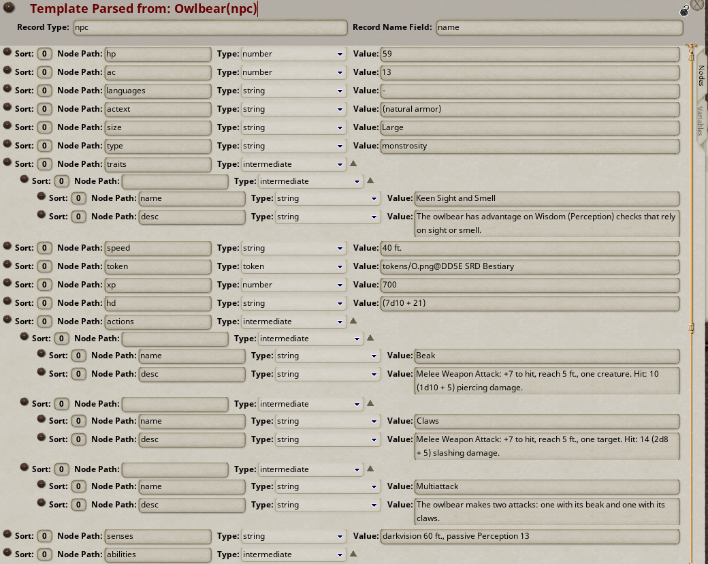

## The Record Inspector

This part of the extension isn't strictly required to use the record templates, because you can just look at the expected data 
structure for any record types you want to create using a text or XML editor. 

However, given that many people would not want to do that for every record type they want to create, I added a Record Inspector 
that will parse existing campaign records into the format of the Record Templates in order to allow users to figure out 
their data structure and define their own custom Record Templates.

The Record Inspector is used by dragging and dropping any desired record onto the little target icon next to the "Record Templates" 
button in the Story record list:

Dropping a record here will parse the data contained in the record (removing any empty children) and display it as if 
it were a record template. Generally speaking: dropping any record onto the inspector, then dropping that generated template
record into a story template, would create an exact copy of the inspected record in the generated story.

Of course the purpose is not to create the most convulted possible way of copying campaign records, but rather to give users 
a visual tool to learn the expected data structure of any campaign records.

For example, inspecting a vehicle record in Savage World Deluxe yields a template like this:

Or inspecting an NPC record in 5e would yield something like this:

By inspecting existing or manually created records, you can see their structure and how to create your own templates to 
generate them in your story templates.