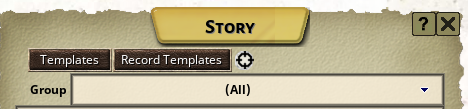

## Creating Record Templates

The Record Templates can be accessed in the same way as Story Templates, via a button in the Story list:

### How to define and use Record Templates

The only statically required fields in the record template are those in the header:

The record type field and name field are required to create the generated record. The type field is what sets what link 
class is used in the final generated record.

Below this is the node definition table. Here, you define entries for the data nodes. Data nodes have a name, type and value 
field.

The type field is always required. For end nodes containing data, the name and type fields  must match the database node name 
and data type expected by the record window class. For non-end nodes select "intermediate" as the node type to create 
intermediate nodes containing child nodes. These can be nested as required by the underlying record type data structure.

In order to know the correct structure, you can either directly look at the db.xml file or use the Record Inspector 
to look at the data underlying campaign records containing data in the desired fields.

If a node name is not required (for example records in a windowlist) it can be left empty and the DB child nodes will be created
as unnamed nodes. This is typically used when you have a list of records of the same time, the normal way that those are stored 
in the DB is "id-00001", "id-00002", etc. 

### Defining Node Values

Each individual record template linked in a story template will have its values processed together as if it were its own story 
template body. As a result, any of the markup conventions used in Story Templates should work in Record Templates. For example:

* [TableName]   -   Resolve the results of a table
* [:TableName:storageName]      -   Resolve the results of a table and store it in a variable available to other nodes in the same Record Template (but not across Record Templates)
* &lt;storageName&gt;   -   Resolve a stored variable from within the same Record Template
* {:TableName:globalStorageName} -   Resolve the results of a table and store it in a globally-accessible variable, available across Record Templates
* {globalStorageName}   -   Resolve a globally stored variable within or across Record Templates

And so on. I won't go through the full suite of Story Template uses, but generally speaking these should all work in Record Templates 
the same as they do in Story Templates.

#### "Copy Node" type

In addition to the standard FG data types, and the "intermediate" type, the only other node type is the "copy node" type. 
This requires that the node value contain a record link or other DB path, and it will simply copy the contents of that path into 
the record node. 

This is useful for lists of record types with the same structure as their underlying source record type. 
Such as a weapons list, a list of feats/edges/spells, etc.

###Custom Record Variables

In addition to the standard Story Template syntax, I also added 2 custom variable behaviors that I found were important to use 
the tool in the way I wanted for my own nefarious purposes. These variables are defined via the Variables tab:

#### Exclusive Groups

Exclusive Groups are a string field containing a comma-separated list of string values. When stored as a variable, these can be 
referenced by nodes to take one element of the list, exclusively. Meaning: if six entries are in an Exclusive Group variable which 
is then referenced six times in the nodes list, each node will get a different one of the six entries.

I found that I just kept wanting this specific functionality in order to generate NPCs with a consistent stat distribution 
for balance purposes. 

#### Record Type

This is just a quick-and-dirty way to get a random record of a data type that is defined in the LibraryData for the campaign. 
I just found it a useful timesave and avoids having to create endless tables of lists of various record types, when generally 
you can get a good result without having to do anything by just using this and getting a link to a completely random record 
of the specified type.

In both cases, to use the variable you just put the variable name string into the value field of the nodes:

### Child Values from Links

If a variable or table reference contains a record link, you can give a relative path to a child value of that record using 
.child or .path notation. You can see this in the above example referencing the name value of the skillOne record link. 
This also works with links contained in table references, just put the .path portion outside of the brackets.

You can also combine multiple references in a single field, as long as they are separated by whitespace. Both of these can 
be seen in this example, which formats a 5e weapon record from a table result into the "Action" format that is found in NPC 
record sheets:

This will produce output that looks like the following (note that in this example the description field of the underlying 
weapon record was empty, which is why it is not present in the output):

