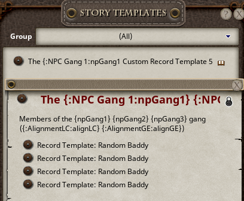
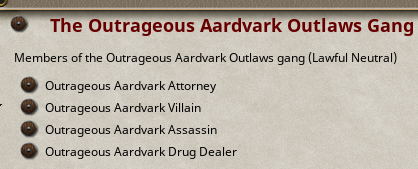

## Using Record Templates

To use record templates in your Story Templates, just drag/drop them into the Story Template. This will add them as links 
in a linklist, and the extension will find any linked Record Templates in a Story Template when generating it, replacing them 
with links to the appropriate generated children.

This is what that looks like from my example 5e module:

When generated, the links will be replaced with links to the generated child records (in this case, 4 generated NPCs):

### Created Records Location

In order to prevent them from cluttering up manual campaign records, all the generate record types are created as children 
of the generated story itself. So if the generated story is deleted, the generated records will be deleted as well.

To add to your general campaign data, just drag/drop any desired records into their appropriate record list from the library.